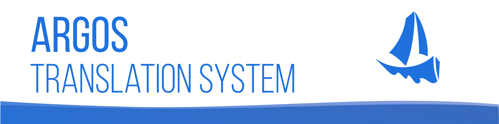
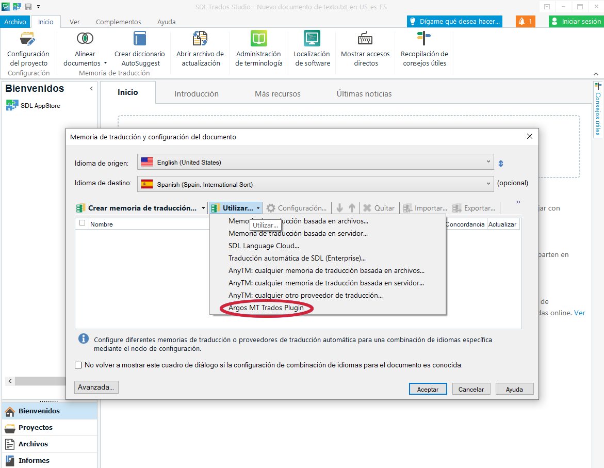
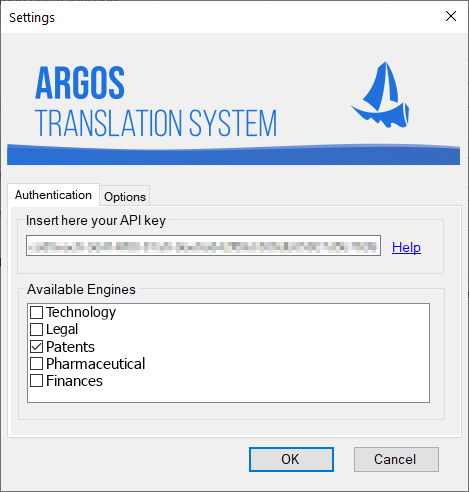

# Argos MT Trados Studio Plugin

Desde [Argos TS](https://argos-ts.com/) ofrecemos motores de traducción a medida según el tipo de texto y combinación lingüística. Integrar este servicio en SDL Trados Studio es muy sencillo:

## Instalar el plugin

Para poder utilizar el servicio de `Traducción Automática` es necesario instalar el plugin de [Argos TS](https://argos-ts.com/). Para ello puede compilarse manualmente o descargarse desde [SDL AppStore](https://appstore.sdl.com/).

## Crear un nuevo proyecto

Una vez está instalado el plugin, podemos proceder a crear un nuevo proyecto. A la hora de configurar las combinaciones lingüísticas, Trados nos permite seleccionar recursos para ayudar en el proceso de traducción. Escogeremos el motor [Argos TS](https://argos-ts.com/) tal y como se muestra en la siguiente imagen:

## Selección del motor de traducción

Cuando seleccionemos el proveedor de `Traducción Automática`, nos mostrará el siguiente diálogo:

En él debemos introducir la clave de API que se nos haya previsto previamente. Para conseguir una clave nueva, puede solicitarse mediante [este enlace](https://argos-ts.com/contacto/).
Al introducir la clave, se nos mostrarán los motores disponibles para la combinación lingüística seleccionada. Debemos seleccionar cuál es el idóneo para el tipo de texto que queramos traducir y hacemos click en `OK`.

## Traducción del documento

A partir de este punto ya podremos utilizar el motor seleccionado para la traducción en curso. Simplemente al hacer click en un segmento de destino vacío, éste cargará la `Traducción Automática`. De manera similar podemos cargar en lote la traducción de todos los segmentos mediante la función `Pretraducir documento` que ofrece SDL Trados Studio.

## Autores

Este plugin ha sido construido por el equipo de Argos TS en base a los plugins disponibles en [SDL Community](https://github.com/sdl/Sdl-Community).

## Licencia

Este proyecto está bajo la Licencia GPL-2. Consulta el archivo [LICENSE](LICENSE) para más detalles.

